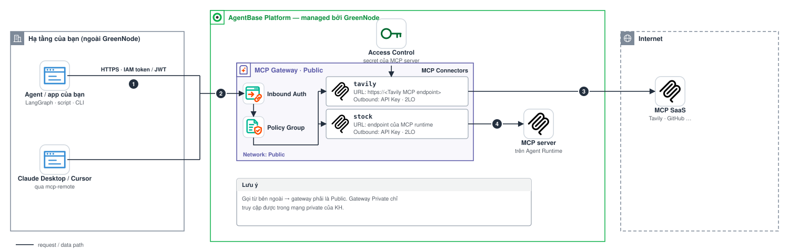

# Bring Your Own Agent + MCP Gateway — an agent running OUTSIDE AgentBase calls tools through MCP Gateway

> A sample client showing **your own agent/app** (laptop, your own server, another cloud — *not* running on AgentBase Runtime)
> calling tools through **GreenNode MCP Gateway**. Every call still goes through **authentication → Policy Group → Outbound Auth → MCP server**,
> so you get AgentBase governance (auth, policy, audit) for tools wherever the agent runs.

[](https://github.com/GreenNode-Samples/sample-byo-agent-mcp-gateway/actions/workflows/ci.yml)
[](LICENSE)

## Why does this repo exist?

The other samples ([`travel-buddy`](../sample-travel-buddy), [`mcp-stock-server`](../sample-mcp-stock-server))
run *on* AgentBase, where the runtime has a service account injected automatically. But many customers already have their own agents
(LangGraph, Claude Desktop, Cursor, internal applications, etc.) and only want to **use the gateway as a governed tool entry point**:

- **A single entry point** to many MCP servers — the agent does not hold each service's API key (the connector handles Outbound Auth).
- **Policy Group**: decides who may call which `<connector>__<tool>`, regardless of where the agent runs.
- **Centralized audit** at the gateway.

## Architecture



```
 Your agent (laptop / server / another cloud)
   ├─ LangChain agent (src/agent.py)  ├─ CLI (src/list_tools.py)  └─ Claude Desktop / Cursor (mcp-remote)
        │  MCP streamable HTTP (JSON-RPC: tools/list, tools/call)
        │  Authorization: Bearer <IAM token | JWT from your IdP>
        ▼
 ┌──────────────────────────────────────────────────────────────┐
 │ MCP Gateway  https://gw-<gateway>-<id>.agentbase-gateway…/<connector>
 │  ① Inbound Auth  — IAM Permissions | JWT | (No authorization: dev only)
 │  ② Policy Group  — first match wins; no matching rule → 403
 │                    (tools/list skips policy, tools/call is checked)
 │  ③ Connector     — Outbound Auth (API Key / OAuth / none) held by the gateway
 └──────────────────────────────┬───────────────────────────────┘
                                ▼
                           MCP server (e.g. the `stock` connector from the mcp-stock-server repo)
```

**LLM calls take a separate path**: your agent calls the LLM (GreenNode AI Platform or any OpenAI-compatible LLM) directly, not through the gateway.

## Structure

| File | Purpose |
|---|---|
| `src/gateway_auth.py` | `get_iam_token()` (cached, thread-safe, 60s margin) · `auth_headers()` for `GATEWAY_AUTH=iam\|jwt\|none` · `GatewayAuth`, an `httpx.Auth` that attaches a current token to every request and retries once on 401 |
| `src/gateway_errors.py` | Shared error handling: `ConfigError`, mapping of 401/403/404/5xx/network errors to an actionable hint |
| `src/gateway_client.py` | One long-lived MCP session per connector (`langchain-mcp-adapters`), tool-result truncation, duplicate tool-name check |
| `src/list_tools.py` | CLI using the `mcp` SDK: lists tools, `--call` invokes one tool, explains 401/403/404 errors |
| `src/agent.py` | LangChain agent (`create_agent` + middleware guardrails) that uses the tools of 1+ connectors; one-shot or `--chat` |
| `scripts/print_token.py` | Prints a fresh IAM token, or writes it to a header file (`--header-file`) for Claude Desktop / Cursor / curl |
| `examples/` | `mcp-remote` configs for Claude Desktop & Cursor |
| `tests/` | Hermetic pytest suite (no network) |

## Step-by-step setup

### 1. Configure Inbound Auth on the gateway

Console → AgentBase → **MCP Gateway** → your gateway → *Inbound Auth* (the `agentbase-gateway` skill can do this via the CLI). Choose **one**:

| Mode on the gateway | `GATEWAY_AUTH` | What you need |
|---|---|---|
| **IAM Permissions** | `iam` (default) | Create an **IAM service account** (Console → IAM → Service accounts) → obtain the `client_id` / `client_secret`. The code exchanges them for a Bearer token using the client-credentials flow. |
| **JWT** (the gateway's default Inbound Auth type) | `jwt` | Register your IdP (Okta, Auth0, Keycloak, Entra ID, etc.) via the **Discovery URL** or **JWKS**; choose the claim to use as the principal (default `sub`). The code only sends the JWT you supply in `GATEWAY_JWT` / `GATEWAY_JWT_FILE`. |
| **No authorization** | `none` | Dev only — anyone who knows the URL can call it. |

> `GATEWAY_AUTH` defaults to **`iam`** in this repo's code, whatever the gateway's own default is: if your gateway uses JWT, set `GATEWAY_AUTH=jwt`.
>
> Outside AgentBase, `GREENNODE_CLIENT_ID` / `GREENNODE_CLIENT_SECRET` are **not** injected automatically as they are on Runtime — you create and manage them yourself.

### 2. Get the connector URL

Gateway detail page → connector → copy the endpoint, which has the form
`https://gw-<gateway>-<id>.agentbase-gateway.aiplatform.vngcloud.vn/<connector>` (e.g. `/stock`).

### 3. Allow your principal in a Policy Group

The gateway **denies by default**: with no Policy Group attached, or no matching rule, `tools/call` returns `403` (`tools/list` is always allowed).
Principal: `iam:<service account identifier>` with IAM, or the configured claim value (e.g. `sub`) with JWT. Actions have the form `<connector>__<tool>`:

```json
{
  "effect": "allow",
  "principal": "iam:<your-service-account>",
  "actions": ["stock__stock_quote", "stock__top_gainers", "stock__valuation"],
  "resources": ["gateway:<gateway-name>"]
}
```

See the `agentbase-policy` skill. If you do not know the exact principal, try calling a tool — the gateway will deny it (403) and the audit log records the principal so you can match it. *Verify the principal syntax against your gateway version.*

### 4. Install and configure the environment

Requires Python 3.10+ (CI runs 3.10 and 3.12).

```bash
python3.12 -m venv .venv && source .venv/bin/activate
pip install -r requirements.txt
cp .env.example .env     # fill in MCP_GATEWAY_URL(S), GREENNODE_CLIENT_ID/SECRET (or GATEWAY_JWT), LLM_API_KEY
set -a; source .env; set +a
```

The code rejects the placeholders of `.env.example` (`change-me`, URLs with `<...>`) before it makes any network call.

## Run

### A. List / call tools (no LLM needed)

```bash
python src/list_tools.py
python src/list_tools.py --call stock__stock_quote --args '{"symbol":"VNM"}'
```

Use the exact tool names printed by `tools/list` (the connector prefix depends on the gateway version; *the policy action is always `<connector>__<tool>`*).

Exit codes: `0` success, `1` configuration / authentication / network / gateway error (a one-line message, no traceback),
`2` the tool failed (`isError=true`, or an MCP error) or does not exist.

### B. LangChain agent

```bash
python src/agent.py "Which stock gained the most today, and how is it valued?"   # one question
python src/agent.py --chat                                                        # multi-turn; `exit` or Ctrl-D quits
```

`MCP_GATEWAY_URLS` accepts multiple connectors (comma-separated) and the agent sees the tools of all of them. Each connector is named by the last
segment of its URL and gets **one MCP session for the whole run**; credentials are attached to every HTTP request, so a long `--chat` keeps
working after the IAM token is refreshed. Tool names must be unique across connectors: the agent stops with an error instead of letting one tool shadow another.
Default LLM: GreenNode AI Platform (`https://maas-llm-aiplatform-hcm.api.vngcloud.vn/v1`, model `z-ai/glm-5.3-flash`); change `LLM_BASE_URL` / `LLM_MODEL` /
`LLM_API_KEY` to use another OpenAI-compatible LLM. The answer is streamed to stdout; logs (`LOG_LEVEL`, default `INFO`) go to stderr and include the token usage of each run.

Guardrails (`build_agent` in `src/agent.py`, built with `langchain.agents.create_agent` middleware):

| Concern | Behaviour |
|---|---|
| Runaway loops | At most 10 model calls and 20 tool calls per run; hitting the model limit ends the run with a message |
| Gateway errors | 401 / 403 / 404 / timeouts / 5xx become a tool error message the model can act on ("denied by gateway policy, do not retry", ...); the run finishes and later calls still work |
| Retries | LLM: 2 retries on 429 / 5xx / connection errors. Tools: 2 retries on timeouts and 5xx only, never on 401 / 403 / 404 (a timed-out call may still have run: remove the tool retry if your tools are not idempotent) |
| Context size | Old tool results are cleared above ~20k tokens and the conversation is summarized above ~40k; each tool result is cut to 8,000 characters |
| Prompt | Tool output is treated as data, not instructions; the system prompt carries today's date |

### C. Claude Desktop / Cursor

```bash
set -a; source .env; set +a
python scripts/print_token.py     # paste after "Bearer " in env.AUTH_HEADER in examples/*.json
```

Copy `examples/claude_desktop_config.json` or `examples/cursor_mcp.json` into the client's config (details in [examples/README.md](examples/README.md)).
IAM tokens expire after ~30 minutes; for long-term use, choose a JWT from your IdP, or run `python scripts/print_token.py --header-file PATH`
from cron / launchd and point `mcp-remote --header-file` at it (a cron and a launchd example are in [examples/README.md](examples/README.md)).

## Troubleshooting

| Symptom | Cause | Resolution |
|---|---|---|
| `401 Unauthorized` | Inbound Auth rejected the request: `GATEWAY_AUTH` does not match the gateway, token expired, JWT has the wrong issuer/audience/JWKS, or wrong client id/secret | Match the mode; rerun to get a fresh token; check the Discovery URL/JWKS configuration |
| `403 Forbidden` | Authentication succeeded but the **Policy Group** does not allow this principal to call `<connector>__<tool>` (or no Policy Group is attached) | Add an allow rule with the correct principal + action; remember that first match wins |
| `tools/list` works but `tools/call` returns 403 | By design: `tools/list` skips policy | Same as the row above |
| `404` / `Session terminated` | Wrong connector path in the URL | Re-copy the endpoint from the gateway detail page (`…/<connector>`) |
| Timeout / `All connection attempts failed` | A **Private** gateway is reachable only from your private network (VPN/VPC), or egress is blocked | Run the client in a network connected to the gateway, or use a Public gateway + Inbound Auth + IP allowlist |
| `Missing GREENNODE_CLIENT_ID…` | Credentials not set or still `change-me` (they are not injected automatically outside AgentBase) | Fill in `.env` and `source` it again |
| `IAM token request failed: …` | The IAM token endpoint rejected the client id/secret (HTTP 401), was unreachable, or answered with something unexpected. This is **not** a gateway Inbound Auth problem | Check the service account's client id/secret, and network access to `iam.api.vngcloud.vn` |
| `Tool '…' is exposed by connector '…' and by '…'` | Two connectors in `MCP_GATEWAY_URLS` publish the same tool name | Drop one connector, or rename the tool on its MCP server |
| `5xx` | Error in the connector / the MCP server behind it | Check the MCP server's runtime logs |

## Security

- **Do not commit secrets**: `.env` is already in `.gitignore`; keep `client_secret`, JWTs, and `AUTH_HEADER` out of configs pushed to git.
- **Rotate** the client secret regularly; revoke the service account when it is no longer used.
- **Least privilege**: one principal per agent/service account, and policies that list only the actions required — avoid `"*"`.
- Do not use *No authorization* outside dev environments; for a Public gateway, also restrict the access source.
- Desktop client configuration: prefer `--header-file` (written by `scripts/print_token.py --header-file`, mode 600) so the token does not appear in the process list.

## Test

```bash
pip install -r requirements.txt pytest ruff
python -m pytest tests/ -q   # hermetic: only talks to an in-process stub gateway on 127.0.0.1
ruff check --select F,E9,B,UP,SIM --target-version py312 .
```

Coverage: IAM token caching, refresh and failure reporting; per-request credentials (`GatewayAuth`, including a token rotated mid-run and the 401 retry);
environment validation; the CLI exit codes; mapping of 401/403/404/network errors (including when the SDK wraps them in an `ExceptionGroup`);
and the agent against a stub gateway with a scripted fake LLM (loop cap, policy-denied tool, tool errors, oversized results, duplicate tool names, `--chat`).

## Combine with another sample

Use it as the call target: [`sample-mcp-stock-server`](../sample-mcp-stock-server) — register the `stock` connector
in the gateway, allow the `stock__<tool>` actions in a Policy Group, then point `MCP_GATEWAY_URL` at `…/stock`.

## Related resources

- Skill `agentbase-gateway` — gateway, connector, Inbound/Outbound Auth
- Skill `agentbase-policy` — writing `<connector>__<tool>` policies
- Skill `agentbase-llm` — AI Platform LLM API key

## License

[MIT](LICENSE)
